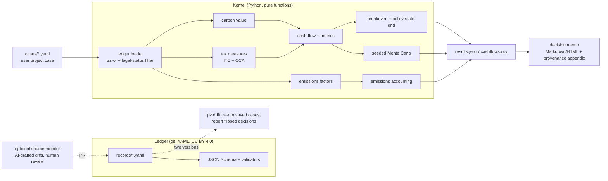

# Architecture overview

*Version 0.2 — 2026-09-30. Decisions are recorded as ADRs in [`adr/`](adr/).*

## Shape



## Components

| Component | Responsibility | Tech |
|---|---|---|
| `ledger/` | Versioned policy parameters with provenance and legal status | YAML, JSON Schema, git tags (`ledger-vYYYY.MM.N`) |
| `pv.ledger` | Load, validate, filter by `as_of` and minimum legal status, resolve overrides | pydantic v2 |
| `pv.registry` (`registry.yaml`) | Wiring: which ledger record supplies each model role; plan-level model assumptions. Keeps record ids and policy structure out of the formula modules | YAML + pydantic |
| `pv.carbon` | Realized carbon value path per facility/scenario (coverage, market, floor, CCfD, QC C&T) | numpy |
| `pv.tax` | ITC rate by in-service year and labour flag; eligible base net of assistance; CCA schedules | pure Python |
| `pv.cashflow` | Annual after-tax cash flows; NPV, IRR, payback; value stack | numpy + scipy (`brentq`) |
| `pv.robustness` | Breakeven carbon; discrete policy-state grid; seeded MC; one-way sensitivity; CCfD strike solver — all over one vectorized NPV evaluator | numpy |
| `pv.emissions` | On-site and grid emissions, average vs marginal | pure Python |
| `pv.report` | Memo rendering (Markdown → HTML) and provenance appendix | Jinja2 |
| `pv.schemas` | Published contracts: `pv.results/v1` JSON Schema, case schema (from the model), record schema | jsonschema |
| `pv.export` | Ledger export (JSON, CSV, static HTML) and the freshness review queue | Jinja2 |
| `pv.cli` | `validate`, `run`, `drift`, `schema`, `case template`, `ledger show/due/export`; `--overrides` for uncommitted licensed values | Typer |
| `tools/` | Pilot scorecard (G1); outside the product package | Python |
| CI | Tests, ledger validation, freshness SLA, link check, drift on ledger PRs | GitHub Actions |
| Static ledger site | Browsable ledger with citations: `pv ledger export` → GitHub Pages (manual `ledger-site` workflow) | Jinja2 → Pages |

## Key design rules

1. **No number without a source or a formula.** Ledger values cite sources; kernel values are pure functions of case + ledger + seed.
2. **Headline carbon price is never the default.** It is available only as a labelled upper-bound scenario (ADR-0005).
3. **Legal status is first-class.** An `announced` value is a scenario until it is `enacted` or `in_force`; the user chooses the trust threshold (ADR-0002).
4. **Determinism.** No network calls, clocks or LLMs in the valuation path. MC uses an explicit seed (ADR-0003).
5. **Zero operating cost.** No servers in the MVP (ADR-0004).

## Repository layout (target)

```
ledger/
  schema/record.schema.json
  records/
    federal/{carbon_benchmark.yaml, ct_itc.yaml, ccus_itc.yaml, ce_itc.yaml, cca_expensing.yaml, nir_factors.yaml}
    ab/{tier.yaml, tier_floor.yaml, tier_credit_obs.yaml}
    on/{eps.yaml, epu_obs.yaml}
    bc/{obps.yaml, credit_obs.yaml}
    qc/{spede.yaml, auction_obs.yaml}
    instruments/{ccfd_canada_alberta.yaml}
  CHANGELOG.md
src/pv/{__init__,ledger,registry,carbon,tax,cashflow,robustness,emissions,results,report,export,drift,cli}.py
src/pv/registry.yaml                 # record wiring + model assumptions (no policy values)
src/pv/schemas/results.v1.schema.json
src/pv/templates/{memo.md.j2, ledger.html.j2, cases/{heat_pump,abatement}.yaml}
tools/pilot_scorecard.py
cases/{golden_hp_qc.yaml, golden_hp_bc_covered.yaml, golden_ab_abatement_ccfd.yaml}
tests/{unit,property,golden,ledger,tools}/
validation/   # research-phase models (frozen)
docs/
```
